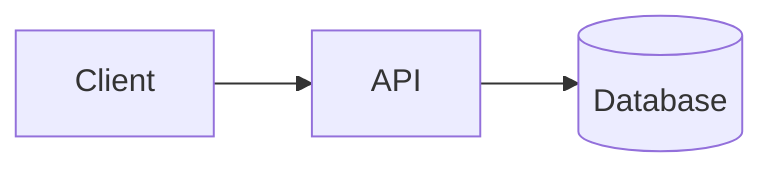

# Architecture

> Owner: the `planner` subagent. This is the living system design document — keep it
> accurate as the system evolves. Read it before any structure-level decision, and skip it
> otherwise. `.ai/memory/repo.md` only links here; don't duplicate content between the two.

## System Overview

`<One paragraph: what the system is, its major runtime pieces, and how a request flows
through them end to end.>`

## Components

`<Bullet list: component/service name — responsibility — key tech/framework.>`

## Data Flow

`<How data and requests move between components. A diagram is optional:>`

## Key Design Decisions (ADR-lite)

> Reverse-chronological. Never edit or delete a past entry — if a decision changes, add a
> new entry that supersedes it and say what it replaces.

- `<YYYY-MM-DD>` — `<decision>` — why: `<rationale>`; alternatives considered: `<...>`

## Open Questions

`<Architecture-level questions not yet resolved.>`
